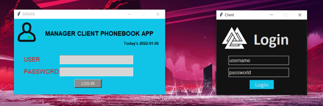
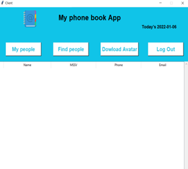
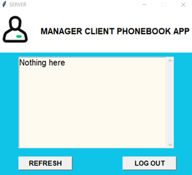
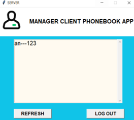
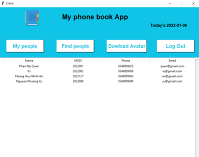
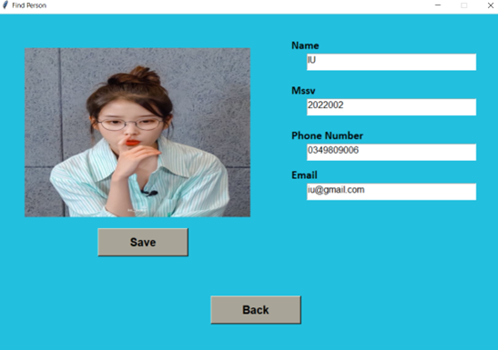
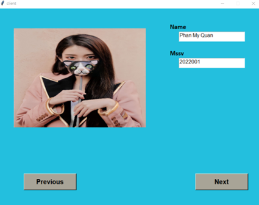
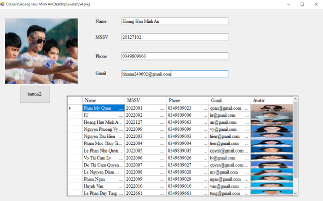
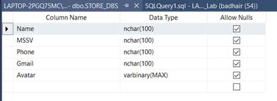
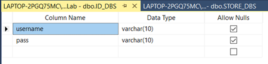

# 👨‍💻 Phone Book App - Socket IO

Write a program consisting of a server application and a client application to manage a "digital directory" using Sockets, with TCP at the Transport layer. This directory manages the information of members in an organization. Information for a member includes: code, full name, phone number, email, avatar. Contacts are stored on the server along with image files, the server provides services so that the client can query the directory (list of members) and query information for each member.
## 🍀 Member

1. Hoàng Hữu Minh An   ID: 20127102
2. Lê Phan Duy Tùng   ID: 20127661
3. Thái Văn Thiên    ID: 20127631

## 📲 UI

- Login
    - client

        

    - server

        
        
        

## ⌨️ Function
- Query contact information: The client queries the list of members being managed by the server, displays on the interface at least the following information: code, full name, phone number, email
    

- Query information about 1 member in the phonebook: The client queries a member of the directory that is being managed by the server, displays on the interface at least the following information: code, full name, phone number, email
    

    - Result:

    

    - Save avatar: Press "Save button"

    
    

- Query all avatar from server: The avatar image file must be saved at the server itself.

    

    - Press "Dowload Avatar" and show on client
    - Press "Next" or "Previous" to transfer avatar

## 🛢️ Database
- UI

    

- Data
    - image:
    
        

    - Account

        

